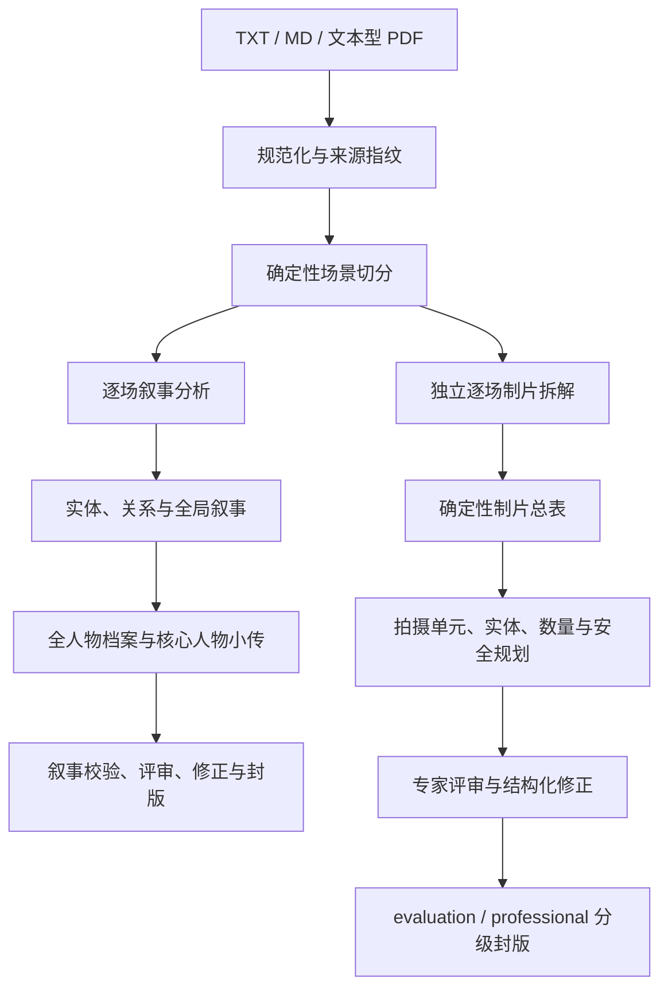

# 电影剧本结构化拆解 CLI

基于 uv、Python、Ruff、Pydantic、Typer、Agno 与 DeepSeek V4 Pro 的电影剧本拆解工具。它把一次性的“大模型长报告”拆成可恢复、可追溯、可验证的结构化流水线，覆盖叙事结构、全人物分级档案、核心人物声明级小传、制片元素、拍摄单元、跨场实体、数量语义、人工修正与分级封版。

当前版本：`1.0.0`。

## 项目状态

当前约定的软件开发范围已经完成，可以作为稳定版本使用。这里的“完成”与真实剧组的专业签署是两件事：

| 范围 | 当前状态 | 含义 |
| --- | --- | --- |
| 剧本导入与场景切分 | 完成 | 支持常见中英文剧本格式，并保留页码、行号和原文映射 |
| 叙事结构拆解 | 稳定 | 逐场分析、全局结构、人物关系、人物弧光、主题与证据闭环 |
| 全人物档案 | 完成 | 所有已归一人物都有分级档案；核心人物另有声明级完整小传 |
| 制片元素拆解 | 完成 | 地点、演员、群演、服化道、车辆、动物、特效、声音与复杂度 |
| 本地制片规划 | 完成 | 拍摄单元、跨场实体、数量与单位、安全范围及修正 generation |
| 评测封版 | 完成 | AI 模拟专家可以形成 `evaluation_ready`，但不构成开拍许可 |
| 专业稳定版门禁（非开拍许可） | 能力完成 | 只有真人专家及逐风险专业批准齐全时才能形成 `professional_stable` |

专业封版被阻断通常表示安全门禁正常工作，不表示软件尚未开发完成。

详细文档：

- [完整 CLI 使用手册](docs/使用手册/README.md)
- [叙事结构拆解方案](docs/叙事结构拆解方案.md)
- [制片元素拆解方案](docs/制片元素拆解方案.md)
- [隐私与数据处理说明](PRIVACY.md)

阅读导航：[完整使用手册](docs/使用手册/README.md) · [安装与配置](#安装与配置) · [快速开始](#快速开始) · [叙事工作流](#叙事完整工作流) · [制片工作流](#制片完整工作流) · [CLI 参考](#cli-命令参考) · [关键数据语义](#关键数据语义) · [封版语义](#准备度与封版语义) · [产物目录](#项目目录与产物) · [开发与测试](#开发与测试) · [当前限制](#当前限制)

## 能力概览

### 叙事结构

- TXT、Markdown 与文本型 PDF 导入和规范化；
- 中英文场景标题的确定性切分；
- 模型辅助格式识别及模型正则的本地安全校验；
- 逐场摘要、人物目标、阻碍、冲突、事件、状态变化、揭示、悬念与伏笔；
- 人物、地点、事件和关系的全局归一；
- 三幕结构、节拍、主线/支线、人物弧光、主题和母题；
- 重要结论尽可能绑定原文场景、行号或页码；主题与母题当前使用结构级共享证据，仍需人工复核；
- 叙事语义风险筛查、专家抽检、人工修正、重新复核和稳定版门禁。

### 人物档案与人物小传

- 为所有已归一人物生成确定性分级档案；
- 分为核心人物、重要配角、功能人物和背景/索引人物；
- 核心人物逐人调用模型生成可恢复、可缓存的声明级小传；
- 将小传声明区分为 `observed`、`reported`、`inferred` 和 `unknowns`；
- 转述记录信息来源，推断记录依据与其他可能，未知信息不会补写成事实；
- 单个人物小传失败后，`resume` 只重跑该人物，不使已成功人物或全局分析失效。

“全部人物都有档案”不等于“全部人物都进行同等昂贵的模型扩写”。完整模型小传只用于核心人物，其余人物保留用于叙事检索和人工审阅的确定性分级档案。

### 制片元素

- 场景设置：地点、子地点、内外景、时段与天气；
- 演员需求：画面出演、仅声音、照片/录像、替身及表演要求；
- 群演需求：群体描述、数量边界、特殊技能；
- 服装、妆发、手持道具、陈设、车辆和动物；
- 动作特技、实拍特效、视效与特殊设备；
- 现场声音、音乐和开放兜底元素；
- 场景复杂度、证据因素与待确认事项；
- 确定性总表与跨场最大同时需求。

### 本地制片闭环

- 将剧本场景细化为可审计的 `ShootingUnit`；
- 使用 `resource class → entity → occurrence` 三层模型追踪跨场连续性；
- 区分剧本数量事实与人工计划数量；
- 保留原始单位并映射安全的标准单位；
- 确定性重建枪械、火焰、烟火、车辆、动物、高空、水下、人体伤效等风险；
- 对危险默认实现进行不可绕过的明确否决；
- 通过指纹绑定的专家答案和结构化修正原子激活新 generation；
- 修正后强制基于新规划指纹重新评审；
- 分别生成评测封版与专业封版报告。

## 总体流程



制片流水线只读复用共享场景，不读取叙事逐场判断、人物小传或叙事修正结果，也不会改写叙事 `artifacts/manifest.json`。

## 系统要求与输入格式

- Python `>= 3.12`；
- uv；
- Windows PowerShell 示例为本文默认命令格式；
- DeepSeek API Key：分析模型命令必需，`doctor` 无论是否联网都会检查是否已配置。

支持的文件：

| 文件 | 支持情况 |
| --- | --- |
| `.txt` | 支持 UTF-8 BOM、UTF-8、GB18030 |
| `.md` | 支持，与 TXT 使用相同解码策略 |
| `.pdf` | 仅支持能够直接提取文字的 PDF，并保留页码映射 |
| 扫描 PDF | 不内置 OCR，须先转成文本型 PDF 或 TXT |
| `.fdx`、`.docx`、`.markdown` | 当前不支持 |

中文剧本为主要目标，同时支持常见英文 `INT.`、`EXT.`、`INT./EXT.` 等场景标题。

## 安装与配置

### 1. 安装依赖

当前版本以源码安装为准。克隆或下载仓库后，在项目根目录执行：

```powershell
uv sync --locked
uv run movie-breakdown --version
```

上述 `uv` 命令在 Windows、macOS 和 Linux 一致。只有复制环境文件的命令因终端不同而不同。

### 2. 配置环境

```powershell
Copy-Item ".env.example" ".env"
```

macOS、Linux 或其他 POSIX shell：

```bash
cp .env.example .env
```

编辑 `.env`；[.env.example](.env.example) 提供最小模板，完整可选项如下：

```dotenv
DEEPSEEK_API_KEY=
MOVIE_BREAKDOWN_MODEL=deepseek-v4-pro
MOVIE_BREAKDOWN_MAX_RETRIES=2
MOVIE_BREAKDOWN_CONCURRENCY=4
MOVIE_BREAKDOWN_THINKING_ENABLED=true
MOVIE_BREAKDOWN_REASONING_EFFORT=high
MOVIE_BREAKDOWN_REQUEST_TIMEOUT_SECONDS=600
```

| 环境变量 | 默认值 | 说明 |
| --- | --- | --- |
| `DEEPSEEK_API_KEY` | 无 | 模型命令必需；不会写入项目产物或日志 |
| `MOVIE_BREAKDOWN_MODEL` | `deepseek-v4-pro` | 使用的 DeepSeek 模型标识 |
| `MOVIE_BREAKDOWN_MAX_RETRIES` | `2` | 每次模型调用的额外重试次数，范围 0—5 |
| `MOVIE_BREAKDOWN_CONCURRENCY` | `4` | 并发模型任务数，范围 1—32 |
| `MOVIE_BREAKDOWN_THINKING_ENABLED` | `true` | 是否启用模型思考模式 |
| `MOVIE_BREAKDOWN_REASONING_EFFORT` | `high` | 当前支持 `high` 或 `max` |
| `MOVIE_BREAKDOWN_REQUEST_TIMEOUT_SECONDS` | `600` | 单次模型请求超时秒数，必须大于 0 |

Settings 从当前工作目录的 UTF-8 `.env` 读取配置，系统环境变量优先。首次叙事分析会把模型、思考、重试、并发等关键参数写入 `project.json` 并纳入缓存指纹；之后修改 `.env` 不会静默改写既有项目配置。

### 3. 环境诊断

```powershell
# 本地依赖、目录、Key 检查；跳过在线模型列表
uv run movie-breakdown doctor --no-online

# 加上 DeepSeek 在线模型可用性检查
uv run movie-breakdown doctor
```

`doctor --no-online` 仍会检查 `DEEPSEEK_API_KEY` 是否存在；它只跳过在线 `models.list`。

## 快速开始

### 完整叙事分析

```powershell
uv run movie-breakdown analyze ".\examples\sample-screenplay.txt" `
  --project ".\work\示例拆解项目" `
  --framework three-act `
  --format-detection local
```

`examples/sample-screenplay.txt` 是完全合成的公开示例，同时包含中文字段式标题和英文标准场景标题，不包含任何真实剧本内容或预生成模型结论。`local` 使场景格式识别保持纯本地；`analyze` 的后续叙事拆解仍会调用 DeepSeek，因此运行完整分析前需要配置 API Key。

`analyze` 用于创建新项目；目录已经初始化时应改用 `resume`。

```powershell
uv run movie-breakdown status ".\work\剧本拆解项目"
uv run movie-breakdown resume ".\work\剧本拆解项目"
uv run movie-breakdown validate ".\work\剧本拆解项目"
uv run movie-breakdown export ".\work\剧本拆解项目" --format all
```

### 完整制片分析

主项目必须已经生成 `artifacts/scenes.json`：

```powershell
uv run movie-breakdown production analyze ".\work\剧本拆解项目"
uv run movie-breakdown production status ".\work\剧本拆解项目"
uv run movie-breakdown production validate ".\work\剧本拆解项目"
uv run movie-breakdown production export ".\work\剧本拆解项目" --format all
```

## 场景格式识别

`analyze` 提供三种策略：

| 策略 | 行为 |
| --- | --- |
| `auto` | 默认；先用本地规则切分，结果不可信时才调用模型识别格式 |
| `local` | 场景格式识别只使用本地规则 |
| `model` | 强制调用模型生成场景格式画像和候选正则 |

`local` 只表示“场景格式识别不用模型”，后续逐场叙事分析仍会调用 DeepSeek。

`auto` 或 `model` 需要模型识别格式时：

- PDF 只发送前三页和后三页；
- TXT/Markdown 只发送首尾各约 150 行；
- 模型输出必须通过 Pydantic Schema；
- 生成的正则必须以行首锚定、长度不超过 300；
- 本地拒绝回溯引用、环视等高风险语法；
- 正则还必须覆盖模型给出的标题示例，并通过场景数量与平均场长检查。

模型正则验证失败时不会直接执行或静默接受。

## 叙事完整工作流

### 1. 分析、恢复与校验

```powershell
uv run movie-breakdown analyze ".\剧本.txt" --project ".\work\项目"
uv run movie-breakdown status ".\work\项目"
uv run movie-breakdown resume ".\work\项目"
uv run movie-breakdown validate ".\work\项目"
uv run movie-breakdown export ".\work\项目" --format all
```

### 2. 专家抽检

`review` 不调用模型。省略 `--answers` 时生成稳定风险抽样和待填写答案：

```powershell
uv run movie-breakdown review ".\work\项目" --sample-size 16
```

抽样范围为 6—50，默认 16。自动风险信号用于发现高风险结论，不是“叙事正确率”。

填写答案后重新导入：

```powershell
uv run movie-breakdown review ".\work\项目" `
  --sample-size 16 `
  --answers ".\work\项目\exports\human-review-分析指纹.json"
```

允许部分完成，但答案必须绑定当前分析指纹和评分标准版本。

### 3. 人工修正

```powershell
# 零写入预演
uv run movie-breakdown correct ".\work\项目" ".\叙事修正.json" `
  --answers ".\专家答案.json" `
  --dry-run

# 原子激活
uv run movie-breakdown correct ".\work\项目" ".\叙事修正.json" `
  --answers ".\专家答案.json"
```

`--dry-run` 会执行完整指纹、目标路径、类型、证据和确定性校验，但不改变项目任何字节。正式修正会保存修正集合、专家答案、修正回执和正式分析快照。

### 4. 新指纹复核与叙事封版

修正后分析指纹会变化，旧答案不能复用：

```powershell
uv run movie-breakdown review ".\work\项目" --sample-size 16
uv run movie-breakdown review ".\work\项目" `
  --sample-size 16 `
  --answers ".\修正后复核答案.json"
uv run movie-breakdown finalize ".\work\项目"
```

`finalize` 重新检查结构校验、分析指纹、评审身份、抽检规模、完成度、结论、维度评分和风险说明，全部通过后才生成 `stable: true`。

## 制片完整工作流

### 1. 模型拆解

```powershell
uv run movie-breakdown production analyze ".\work\项目"

# 中断、失败或缓存过期时继续
uv run movie-breakdown production resume ".\work\项目"
```

逐场制片分析与叙事模型结果相互隔离。每个场景独立保存状态、尝试次数和 Token 用量。

### 2. 纯本地规划

```powershell
uv run movie-breakdown production plan ".\work\项目"
```

该命令从已验证的制片拆解本地派生：

- 拍摄单元；
- 资源类别、连续性实体与出现项；
- 数量事实和标准单位；
- 高危候选及必需专业角色；
- `draft_valid`、`catalog_ready`、`shoot_ready` 三级准备度。

### 3. 生成并填写制片专家答案

```powershell
# 生成空白模板
uv run movie-breakdown production review ".\work\项目"

# 导入填写后的严格 JSON
uv run movie-breakdown production review ".\work\项目" `
  --answers ".\制片专家答案.json"
```

模板位于 `production/reviews/answers-template.json`。拍摄单元、未确认实体、数量语义、高危候选和危险默认值都会成为强制目标。

### 4. 预演并激活结构化修正

```powershell
# 零写入预演
uv run movie-breakdown production correct ".\work\项目" ".\制片累计修正.json" `
  --answers ".\制片专家答案.json" `
  --dry-run

# 激活不可变 generation
uv run movie-breakdown production correct ".\work\项目" ".\制片累计修正.json" `
  --answers ".\制片专家答案.json"
```

制片修正必须与专家答案双向绑定，并按完整作用域原子替换。例如拍摄单元修正替换该场全部单元，实体修正替换完整实体注册表，避免悬空引用和半完成状态。

### 5. 修正后重新评审

```powershell
uv run movie-breakdown production review ".\work\项目"
uv run movie-breakdown production review ".\work\项目" `
  --answers ".\制片最终复核答案.json"
```

修正后必须针对新 `plan_fingerprint` 重新生成目标集，不能把旧答案静默套用到新规划。

### 6. 分级封版

```powershell
# 评测封版：允许明确标注的 AI 模拟专家
uv run movie-breakdown production finalize ".\work\项目" --profile evaluation

# 专业封版：必须由真人专家和合格专业角色逐风险签署
uv run movie-breakdown production finalize ".\work\项目" --profile professional
```

即使门禁阻断，封版报告仍会保存。`professional` 被阻断时命令以校验失败退出，不应通过脚本忽略。

## CLI 命令参考

所有示例都可以把 `uv run movie-breakdown` 替换为已经进入 PATH 的 `movie-breakdown`。

### 叙事命令

| 命令 | 主要参数 | 是否调用模型 |
| --- | --- | --- |
| `--version` | 无 | 否 |
| `doctor` | `--directory`、`--online/--no-online`、`--json` | 默认在线检查模型列表 |
| `analyze` | `SOURCE --project/-p PROJECT`、`--framework three-act`、`--format-detection`、`--json` | 是 |
| `resume` | `PROJECT`、`--json` | 是 |
| `status` | `PROJECT`、`--json` | 否 |
| `validate` | `PROJECT`、`--json` | 否 |
| `export` | `PROJECT --format markdown/json/all`、`--json` | 否 |
| `review` | `PROJECT --sample-size 6..50`、`--answers`、`--json` | 否 |
| `correct` | `PROJECT CORRECTIONS --answers ANSWERS`、`--dry-run`、`--json` | 否 |
| `finalize` | `PROJECT`、`--json` | 否 |

当前叙事框架只开放 `three-act`。

### 制片命令

| 命令 | 主要参数 | 是否调用模型 |
| --- | --- | --- |
| `production analyze` | `PROJECT`、`--json` | 是 |
| `production resume` | `PROJECT`、`--json` | 是 |
| `production status` | `PROJECT`、`--json` | 否 |
| `production validate` | `PROJECT`、`--json` | 否 |
| `production export` | `PROJECT --format markdown/json/csv/all`、`--json` | 否 |
| `production plan` | `PROJECT`、`--json` | 否 |
| `production review` | `PROJECT`、`--answers`、`--json` | 否 |
| `production correct` | `PROJECT CORRECTIONS --answers ANSWERS`、`--dry-run`、`--json` | 否 |
| `production finalize` | `PROJECT --profile evaluation/professional`、`--json` | 否 |

`production finalize --profile` 为必填参数。

## 模型与本地命令边界

明确会访问 DeepSeek：

- `analyze`、`resume`；
- `production analyze`、`production resume`；
- 默认 `doctor` 的在线模型列表检查。

纯本地、不读取 API Key：

- `status`、`validate`、`export`、`review`、`correct`、`finalize`；
- `production status`、`production validate`、`production export`；
- `production plan`、`production review`、`production correct`、`production finalize`。

模型命令会把完成任务所需的剧本文本发送给 DeepSeek。密钥只从环境读取，不写入项目、缓存、导出或日志。需要处理敏感剧本时，应先确认所使用模型服务的组织政策和数据处理要求。

联网命令、纯本地命令、缓存位置和删除边界详见[隐私与数据处理说明](PRIVACY.md)。

## 关键数据语义

### 证据优先

重要结论尽可能关联可定位的场景和来源位置；无法逐结论绑定时必须披露限制并进入人工复核。结构正确只代表 Schema、引用、行号与覆盖有效，不代表主题、人物弧光或转折点一定符合编剧判断，因此项目同时提供人工评审层。

### 全人物档案

人物档案来自全局实体、场景、事件和关系的确定性合并。尚未可靠归一的原始称谓不会被伪装成已经确认的同一人物。

### 拍摄单元

`ShootingUnit` 是场景内部可分别确认地点、时段、资源和风险的最小拍摄语义单元。它不是镜头、拍摄日、通告单，也不是摄制组 A/B 组。

单元必须连续、无空档覆盖场景全部原文行；拆分修正会同步重建地点出现项、资源引用和安全范围。

### 跨场实体

| 层级 | 职责 |
| --- | --- |
| `ProductionResourceClass` | 规范名称、资源类别、标准单位和身份范围 |
| `ProductionEntity` | 跨场保持同一身份或连续性状态的具体人物、动物、车辆或英雄道具 |
| `ResourceOccurrence` | 资源在某场、某拍摄单元中的一次可追溯出现 |

同名只会形成待确认候选，不会被静默确认成同一实体。结构化评审可以合并具有明确专名或连续性链的出现项，并把无法证明连续性的泛称、群体或道具出现项保守拆分。

### 数量与单位

`QuantityFact` 只表达原文能够支持的数量、上下界、单位、父子关系和证据。`PlannedQuantity` 才表达人工决定的实拍、数字扩充、采购或备份数量。

系统不会：

- 把模型估算冒充剧本事实；
- 自动把子集与总数重复相加；
- 未经业务确认换算近义单位；
- 根据剧本人数自动生成采购量或预算量。

`peak_quantity` 表示跨场景最大同时需求，不是跨场求和，也不是采购数量。

### 高危安全范围

高危候选由本地规则重新派生，不能被模型或普通修正静默删除。风险范围包含触发规则、场景/拍摄单元、资源、证据、控制项、禁止方法、必需专业角色和范围指纹。

- AI 可以识别风险、要求修正或否决危险默认实现；
- AI 不能签署 `SafetyApproval`；
- 每个风险的每个必需角色都要绑定同一范围指纹形成唯一有效批准；
- 拍摄单元、资源或证据变化后，旧批准自动失效；
- 软件字段声明不等于现实资质认证，项目负责人仍须在线下核验人员资质和权限。

## 准备度与封版语义

### 制片三级准备度

| 准备度 | 主要要求 |
| --- | --- |
| `draft_valid` | 场景覆盖、单元顺序、引用、数量树、证据和 Schema 有效 |
| `catalog_ready` | 在草稿有效基础上，实体已确认、标准单位有效、危险默认方法已处理 |
| `shoot_ready` | 在目录就绪基础上，每个高危范围的每个专业角色均有有效真人批准 |

### 两种制片封版

| Profile | 可以由谁完成 | 代表什么 |
| --- | --- | --- |
| `evaluation` | 明确标注的 AI 模拟专家或真人专家 | 拆解底稿、目录和评审闭环可用于评测与继续制片准备 |
| `professional` | `human_expert` 且高危角色批准齐全 | 数据包达到项目内部“专业稳定版”门禁 |

两者都不自动等于政府许可、保险批准、预算批准、通告完成或现场可以立即开拍。

## 项目目录与产物

```text
项目目录/
├── project.json
├── source/
├── artifacts/
│   ├── manifest.json
│   ├── normalized.json
│   ├── scenes.json
│   ├── scene_analysis.jsonl
│   ├── entities.json
│   ├── events.json
│   ├── relationships.json
│   ├── structure.json
│   ├── character_dossiers.json
│   ├── character_biographies.jsonl
│   ├── biographies.json
│   ├── global_recovery.json
│   ├── validation.json
│   ├── semantic_quality.json
│   ├── corrected_breakdown.json
│   ├── manual_corrections.json
│   ├── correction_receipt.json
│   └── release_gate.json
├── corrections/
│   ├── active.json
│   └── review_answers.json
├── exports/
│   ├── breakdown.json
│   ├── report.md
│   ├── semantic-quality.md
│   ├── human-review-<分析指纹前12位>.json
│   └── release-gate.md
└── production/
    ├── config.json
    ├── manifest.json
    ├── artifacts/
    │   ├── scene_elements.jsonl
    │   ├── catalog.json
    │   ├── validation.json
    │   └── breakdown.json
    ├── planning/
    │   ├── base.json
    │   └── validation.json
    ├── reviews/
    │   ├── report.json
    │   └── answers-template.json
    ├── corrections/
    │   ├── active.json
    │   └── generations/<generation-id>/
    ├── releases/
    │   ├── report.json
    │   └── immutable/<release-id>/
    └── exports/
        ├── breakdown.json
        ├── report.md
        ├── scenes.csv
        ├── catalog.csv
        ├── planning.json
        ├── planning-report.md
        ├── shooting_units.csv
        ├── resources.csv
        ├── occurrences.csv
        ├── quantities.csv
        ├── safety.csv
        ├── issues.csv
        ├── release-evaluation.json
        ├── release-evaluation.md
        ├── release-professional.json
        └── release-professional.md
```

只有执行相应评审、修正或封版命令后，闭环产物才会出现。逐场与逐人物 JSONL 恢复记录、`artifacts/global_recovery.json`、generation 与 immutable release 用于恢复和审计，不应手工覆盖。

## 缓存、恢复与过期规则

缓存键不是文件名，而是由实际影响结果的内容组成：

- 源内容和来源位置；
- 上游产物指纹；
- 阶段版本；
- Prompt 与 Pydantic Schema；
- 模型、思考模式和推理强度；
- 关键运行参数。

`resume` 只重跑失败、缺失或已经过期的阶段。逐场叙事、逐场制片和核心人物小传均保存独立记录，因此单项失败不会迫使整个项目从头开始。

任何旧答案、旧修正或旧安全批准只要指纹不匹配，就会被拒绝，不会静默复用。

## JSON 输出与退出码

所有主要工作流命令都支持 `--json`。成功结果和工作流中已经捕获的应用错误会作为单个 JSON 写入标准输出，模型进度回调会被关闭。CLI 参数解析错误、配置初始化等尚未进入应用错误包装的异常仍可能使用人类可读的标准错误输出。

| 退出码 | 含义 |
| ---: | --- |
| `0` | 成功 |
| `1` | 配置、文件、网络或一般运行错误 |
| `2` | 确定性校验/封版门禁阻断，或命令行参数与用法错误 |

`professional` 因缺少真人批准而返回 2 是预期安全结果；报告仍会写入 `production/exports/release-professional.*`。

## 代码架构

```text
src/movie_breakdown/
├── domain/          # Pydantic 领域模型、枚举和不可绕过的不变量
├── application/     # 用例服务、Protocol、规划、校验、修正和发布
├── infrastructure/  # 文件存储、解析器、内容指纹、Agno/DeepSeek 适配器
├── pipeline/        # 分阶段状态机、缓存、恢复和产物编排
├── cli.py           # 叙事 Typer 入口
└── cli_production*.py
                     # 制片 Typer 子命令
```

组织原则：

- 有状态、有生命周期或存在可替换实现的能力使用类与 `Protocol`；
- Strategy、Repository、Factory 等模式只在职责确实需要时使用；
- 无状态转换、规范化和纯算法保留为函数；
- CLI 只负责参数、交互、渲染和退出码；
- 禁止上帝类和没有业务意义的空壳抽象。

## 开发与测试

```powershell
uv sync
uv run --no-cache ruff check src tests
uv run --no-cache ruff format --check src tests
uv run --no-cache pytest -q
```

当前基线：

- 317 项测试通过；
- 1 项真实 DeepSeek 在线契约测试默认跳过；
- pytest-cov 总覆盖率 88%；
- Ruff 同时检查 import、代码质量和 Google 风格 docstring；
- 自动化约束保证 `src` 下单个 Python 文件不超过 300 行。

真实在线契约测试必须显式开启，且会产生 DeepSeek 调用：

```powershell
$env:MOVIE_BREAKDOWN_RUN_LIVE_TESTS = "1"
uv run --no-cache pytest -q -m live
```

公开模块、类、函数和方法使用中文 Google 风格 docstring；有参数时写 `Args`，有返回值时写 `Returns`，调用方必须处理的异常写 `Raises`。

## 当前限制

- 不内置扫描 PDF OCR；
- 不支持 FDX、DOCX 和 Web UI；
- 当前叙事结构框架只有三幕结构；
- 不自动生成预算、拍摄天数、排期、通告单、供应商或演员人选；
- 不把 `ShootingUnit` 当成镜头表或分镜；
- 不自动推导采购量、备份量或实拍/数字扩充比例；
- 不替代编剧、导演和制片专家对主题、人物弧光、转折点和叙事质量的判断；
- 不认证现实人员资质，也不替代枪械、动作、动物、车辆、烟火等专业部门签署；
- 真实剧本验收产物与通用产品文档分离，不在 README 中记录单个项目的内容或指标。

## 文档索引

README 记录当前可运行状态与通用质量基线；设计文档用于解释领域契约和演进过程。

- [完整 CLI 使用手册](docs/使用手册/README.md)：详细命令、参数、输入输出、示例、人工 JSON、产物说明和故障排查。
- [叙事结构拆解方案](docs/叙事结构拆解方案.md)：叙事阶段、证据、缓存、人物档案、质量评测和稳定版门禁。
- [制片元素拆解方案](docs/制片元素拆解方案.md)：制片 Schema、资源三层模型、数量语义、安全审批、generation 和不可变发布。
- [AGENTS.md](AGENTS.md)：项目代码组织、docstring、测试和真实剧本回归约束。

## 开源与社区

本项目由 [**Andy**](https://github.com/ankunhou) [**(ankunhou)**](https://github.com/ankunhou) 以 [MIT License](LICENSE) 开源。MIT 许可证覆盖本仓库中的代码和项目文档，不自动授予任何输入剧本、模型输出、第三方商标或其他外部材料的权利。

- 参与开发前请阅读[贡献指南](CONTRIBUTING.md)和[社区行为准则](CODE_OF_CONDUCT.md)；
- 一般使用问题与维护边界见[支持说明](SUPPORT.md)；
- 安全漏洞请按照[安全政策](SECURITY.md)私密报告，不要在公开 Issue 中粘贴密钥、剧本或敏感日志；
- 数据发送、本地缓存与第三方服务边界见[隐私与数据处理说明](PRIVACY.md)；
- 版本变化见[变更日志](CHANGELOG.md)。
- 维护者发布流程见[发布指南](RELEASING.md)。
